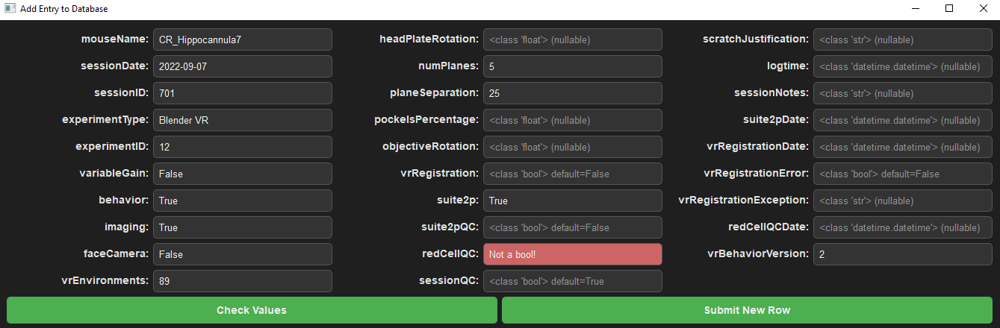

# vrAnalysis Documentation: database

This is some documentation for the database of vrAnalysis. The main goal of
this file is to remind me what I've written so I don't forget. There may be 
room for explaining how it works, but at the moment, I'll just focus on using 
it.

## How it works
The database module is designed to work with a local SQL database. At the 
moment, my SQL database is Microsoft Access, which is available as part of 
Microsoft Office. However, most of the code is generally just SQL code, so the
only place that needs a change for a different database host is in the 
`connect` method found 
[here](https://github.com/landoskape/vrAnalysis/blob/main/vrAnalysis/database.py#L99)
and it has instructions for how to improve compatibility. (By the way, if you
use this code and add compatibility for a new host, please open a pull request
or let me know so I can make it available for everyone). 

This module primarily performs one of two things: 
1. Return pandas dataframes from the database to inform the user
2. Send update commands to the database when requested by the user

It also depends on vrAnalysis functionality, because it continuously interacts
with the `session` object to find the right datapaths, and even automatically
register sessions (i.e. preprocessing) that need it.  

## Standard Usage
This section contains codeblocks explaining how to use the database. Note that
it's designed so it's easy to copy code when previewed on GitHub, so I suggest
checking it out there if you aren't already:

https://github.com/landoskape/vrAnalysis/tree/main/docs/database.md

### Importing the database and creating a connection
The database module is part of the vrAnalysis package. Import as follows and
create a database object (a one size fits all object for communicating with 
the database).
```python
from vrAnalysis import database
vrdb = database.vrDatabase()
```

### Storing a backup of the database
The database is an important object, it contains the data used to manage a
scientific project. Therefore, updating it programmatically can be a little
dangerous since it can overwrite information without you "seeing" what 
happened. To help deal with potential mistakes, the database object has a 
method for saving a backup. Make sure you have a "backupPath" included in the
metadata, then run this method:
```python
vrdb.save_backup()
```

### Retrieving data from the database
The `getTable` method retrieves data from the database and returns it as a 
pandas dataframe. By default, it ignores "scratched" sessions (those that did 
not pass quality control), and can accept additional kwargs corresponding to 
field names of the database and the desired field value. For example, the
following line will return any session for which suite2p has been performed, 
and ignore any sessions that did not pass quality control.
```python
df = vrdb.getTable(suite2p=True)
```

If you simply want to look at the field names of the database, then do this:
```python
for fieldName in vrdb.tableData()[0]:
    print(fieldName)
```

Instead of retrieving a dataframe, you can list sessions meeting the desired
criteria. This uses the readable `sessionPrint()` method of `vrSession` 
objects. Here, we list all imaging sessions for mouse ATL020. 
```python
vrdb.printSessions(mouseName="ATL020", imaging=True, ignoreScratched=False)
```

Alternatively, if you want an iterable list of `vrExperiment` objects 
referenced in the desired dataframe, you can use this:
```python
vrdb.iterSessions(imaging=True, vrRegistration=True)
```

There's also a useful helper function that prints a list of unique mouse names
contained in a session iterable. This is great if you need to figure out what 
work still needs to be done on a mouse by mouse basis (e.g. for red cell QC)
and want to quickly and simply which mice need work. 
```python
vrdb.printMiceInSessions(vrdb.iterSessions(imaging=True, vrRegistration=True, redCellQC=False))
```

### Adding a new session to the database
There is a nice GUI for adding a new session to the database. The GUI loads 
the database fields and data properties then checks your entries to make sure
they are valid. Of course, the database itself will throw an error if the 
entries are invalid when you try to submit the new record. The GUI is nice 
because you can preload data for faster submission and contains a few 
defaults. The code for the GUI can be found 
[here](../vrAnalysis/uiDatabase/addEntryGUI.py).

Below is some code showing how to open the GUI with preloaded data.
```python
# session identifiers
mouseName = 'CR_Hippocannula7'
sessionDate = '2022-09-07'
sessionID = '701'

# create session object 
# (at the moment, this only provides mouseName, sessionDate, and sessionID to the GUI, but will increase later)
ses = registration.vrRegistration(mouseName, sessionDate, sessionID)

# preloaded data
preloaded_data = {
    'experimentType': 'Blender VR',
    'experimentID': 12,
    'variableGain': False,
    'behavior': True,
    'imaging': True, 
    'faceCamera': False, 
    'vrEnvironments': 89,
    'numPlanes': 5,
    'planeSeparation': 25,
    'suite2p': True,
    'vrBehaviorVersion': 2,
}

# load the database connection
vrdb = database.vrDatabase()

# then open the GUI
gui = addEntryGUI.newEntryGUI(vrdb, ses=ses, **preloaded_data)
```

It looks like this:


If you press the button on the right (`Submit New Row`), then it will attempt
to submit the data to the database as a new row. The database object checks if
any other record contains the same session identifiers (the `mouseName`, 
`sessionDate`, and `sessionID`). If it does, then it prevents addition of the 
new entry.

Extra notes: 
- When a field is empty, the placeholder text indicates the required datatype
  and the default value, if it exists. All inputs are strings (e.g. "text"),
  but the GUI checks whether the string can be converted to the required type
  with the `validate_input` method. 
- If you press the button on the left (`Check Values`), then it will validate
  if the data in each field is valid. Entries turn to red if they are not. As
  an example, I filled the `redCellQC` field with the text `Not a bool!`,
  which cannot be converted to a boolean, so the edit field turned red. 


### Registering Sessions
You can register sessions from the `database` object, which is good practice
because it automatically updates the SQL database appropriately. To update a
single session, use this command, where the three arguments are the mousename, 
datestring, and sessionid:
```python
mouseName = 'ATL022'
dateString = '2023-04-26'
sessionid = '701'
vrdb.registerSingleSession(mouseName, dateString, sessionid)
```

To determine which sessions need registration, use this line. Note that 
default behavior is to skip sessions that have already experienced an error in
registration. You can add kwargs to filter the table even further. Also note
that the default behavior is to produce a session iterable (a list of 
vrExperiment objects). You can return a dataframe directly by setting the 
optional argument ``as_iterable=False``.
```python
vrdb.needsRegistration(skipErrors=True)
```

To register all sessions that still require registration, you can use this 
method. There is a kw argument called `maxData` that restricts how much 
oneData can be produced each time this is run -- (registration saves oneData 
which can be a lot of memory). Additionally, you can specify `userOpts` which
are passed to the `vrRegistration` object that determine how to register each 
session.
```python
def registerSessions(self, maxData=30e9, skipErrors=True, **userOpts):
```

If an error was encountered during registration, it is saved in the SQL 
database. To find out what errors have been encountered, use the following 
line. Note that default behavior is to avoid scratched sessions, and usually I
scratch sessions that encountered insurmountable registration errors...
```python
vrdb.printRegistrationErrors(ignoreScratched=False)
```

### Managing suite2p information
To determine which sessions require suite2p to be performed (i.e. they are a
session that is not scratched, that has imaging data but has not been 
processed through suite2p), use this: 
```python
df = vrdb.needsS2P()
```

If you want to look at sessions in which suite2p _has_ been performed, but has
_not yet_ been quality controlled, use this:
```python
df = vrdb.needsS2P(needsQC=True)
```

In addition to both of the above methods, you can also use 
`printRequiresSuite2P`, which prints a list of sessions following the same 
description as above. It also has the `needsQC` switch. Additionally, default 
behavior is `printTargets=True` (a kw argument), which prints the suite2p 
target directories in addition to the session name. 
```python
vrdb.printRequiresSuite2P()
```

If suite2p has been run elsewhere or QC'd, you can update the database's 
record of exactly when suite2p files were last updated. (This is useful to 
know when QC was done, and also useful to know if you should re-register any
sessions -- which by the way, I haven't coded yet!). 
```python
vrdb.updateSuite2pDateTime()
```

Lastly, if for some reason the database's record of which sessions contain 
processed suite2p data is inaccurate, you can use this method to correct it.
Note that it will only update the database if you set 
`withDatabaseUpdate=True` and will return a boolean telling you if inaccurate 
records were found if you set `returnCheck=True`.
```python
validDatabase = vrdb.checkS2P(withDatabaseUpdate=True, returnCheck=True)
```

### Managing Red Cell QC Information
There are a similar set of methods for communicating with the database about
which sessions need red cell quality control. They are all explained here in
full anyway. 

To determine which sessions need red cell QC, you can use the following block.
Note that this assumes that the only sessions which need red cell QC are those
in which imaging, suite2p, and vrRegistration have been performed, but red 
cell QC has not. You can add keyword conditions to filter the database before
looking for sessions that need red cell QC. 
```python
df = vrdb.needsRedCellQC(mouseName='ATL028')
```

Or if instead of a dataframe you want it to print the session names, use:
```python
vrdb.printRequiresRedCellQC()
```

The database stores the time at which red cell QC was performed. You can go
through and update the times by using the following block. 
```python
vrdb.updateRedCellQCDateTime()
```

Note that this assumes that the only relevant files indicating the last QC 
update are the following one files:
```python
relevant_one_files = [
    'mpciROIs.redCellIdx.npy',
    'mpciROIs.redCellManualAssignment.npy',
    'parametersRed*', # wild card because there are multiple possibilities
]
```

If you'd like an iterator for vrExperiment session objects of the specific
sessions that need red cell QC, use this: 
```python
ises = vrdb.iterSessionNeedRedCellQC()
```

Finally, if you want to update the QC field (and date/time) of the database,
you can use this block, where the first three inputs identify the session, and
the last `state=True` input determines whether the field should be set to 
`True` or `False`. This is what the `redCellGUI` uses. 
```python
success = vrdb.setRedCellQC(<mouseName>, <dateString>, <sessionid>, state=True)
```
